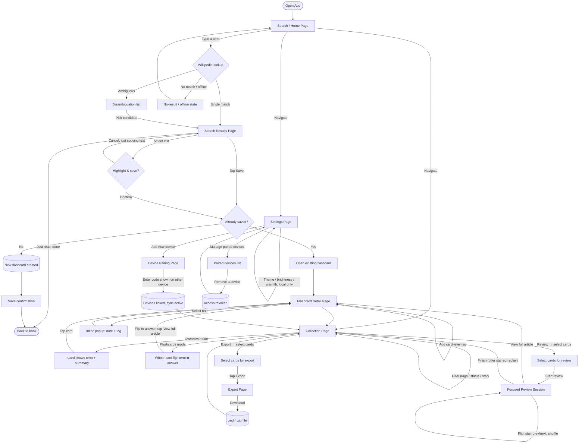

# PRD: Glossary — Distraction-Free Wiki Lookup for Book Readers

> **Build status (2026-07-04):** working prototype in `app/` — search, save, highlight/annotate, flashcards, export, settings, and simulated device pairing are functional. Per the phased build order (§6), the app currently persists to `localStorage`; Firebase sync (Phase 9) and the passive Wikipedia-drift indicator's live checks are the remaining planned work. The visual language is captured in `docs/design.md` (+ `docs/design.html`).

## 1. Executive Summary

**Product overview.** Glossary is a minimalist, installable web app that lets a physical-book reader look up an unfamiliar term in seconds, see just Wikipedia's short intro paragraph and lead image, and get straight back to reading. Terms worth remembering can be saved as flashcards — highlighted, annotated, and tagged — and later exported as Markdown files into Obsidian or Notion. The app runs on any modern phone or laptop browser, works offline for anything already looked up, and syncs flashcards between the reader's own paired devices.

**Problem statement.** Looking up a word on a phone normally means opening a browser or the Wikipedia app — one tap away from social media, messages, or a Wikipedia rabbit-hole. Readers either get pulled off-task, or avoid the lookup entirely and forget the word. There is no existing tool whose *only* job is a fast, contained, distraction-free lookup with a path into a personal revision system.

**Target audience.** The requester themself, as a solo passion project: a reader who wants zero-friction lookups mid-book and a personal, growing glossary of terms to revise later — with no public accounts, no ads, no server bills, and no prior coding experience required to build it.

**Personal goals this serves** (in place of "business goals," since this is a non-commercial personal project): read more deeply without digital distraction; build a durable, personally-curated vocabulary; keep the tool costing $0 to run indefinitely; make it something a first-time builder can actually finish and maintain.

## 2. Key Features

### 2.1 Overarching Product Features

- Instant Wikipedia lookup: intro paragraph + lead image only — never the full article, never a "read more" link out. Long summaries are height-capped with a "show more" affordance so a scan never turns into a scroll.
- Live search suggestions as you type (not just after submit), plus disambiguation candidates for ambiguous or informally phrased searches — both aimed at recovering gracefully from a rushed, one-handed, possibly mistyped search.
- Recent searches list for picking a lookup back up after an interruption.
- Cached lookups work offline: any term looked up once stays available with no connection; a brand-new term still needs one.
- A bookmark-toggle flashcard save, plus a highlight-to-save path: the bookmark icon shows saved (filled) vs. unsaved (outline) state at a glance; the first save opens a card-level **note + tags** dialog, and clicking the filled bookmark again reopens it to edit. Its DELETE unsaves the whole card (confirming first if highlights would be lost). Selecting text in a result surfaces a separate confirm action ("Highlight & save") rather than saving automatically, so plain text selection (e.g. to copy) never has a side effect. Saving checks the canonical Wikipedia title against existing flashcards first — if the term is already saved, the bookmark simply reflects that, never creating a duplicate.
- Inline annotation popup on any highlight, with separate **note** and **tag** fields; a card also carries its own card-level **note** and **tags**, both entered through the bookmark save dialog.
- Two tag levels — on a specific highlight, and on the whole flashcard — unified by a **multi-select** tag filter that searches both (pick several tags at once; a card matching any of them shows), plus autocomplete against previously-used tags to stop near-duplicate tags (e.g. "Sapiens" vs. "sapiens") from fragmenting your organization.
- The saved terms live on a **My Collection** page with two display modes sharing one internal detail view: **Overview** (term, metadata, and a summary preview) and **Flashcards** (a whole-card 3D flip — term on the front, answer plus a "view full article" strip on the back). Beyond tags, the collection filters by review status (reviewed / not), export status (exported / not — stamped whenever a card is included in a download), and a per-card **star** you set for quick recall; the grid paginates at 12 cards. Neither display mode ever links out to the live Wikipedia article.
- A separate **focused review session**, launched by choosing cards under the **Review** action: one large flip card at a time, centered, with shuffle, prev/next, and keyboard support (arrows to move, space to flip). Revealing a card's answer marks it reviewed; the deck is ordered least-recently-reviewed first so revision surfaces neglected terms instead of the same easy ones. Cards can be starred mid-session, and finishing a run with any starred offers an immediate starred-only second pass before returning to the collection. The session holds its place through a detour into a card's full detail and back.
- Multi-select export to Markdown (single file or bundled `.zip`) with YAML frontmatter and embedded images, formatted for Obsidian/Notion — with the known limitation that this produces a downloaded file you move yourself (no direct vault/Notion-API integration), and that Notion's import doesn't parse YAML frontmatter into structured page properties the way Obsidian does.
- Dark and light themes; light mode adds independent brightness and warmth sliders. Adjustable font size/line length for reading comfort. Theme and display preferences are stored per device, not synced — a phone can stay dark for night reading while a laptop stays light for daytime work.
- Installable as a PWA on Android, iOS, and desktop (Chrome/Edge's address-bar install icon), with install nudges tailored to each — on Safari specifically, mobile and desktop alike, this protects not just cached data but the device's sync identity itself (see Section 7).
- Full keyboard and mouse support on desktop as a first-class interaction path, not a scaled-up version of touch: shortcuts beyond the initial search-focus (Enter to submit, Esc to close, Tab through cards), right-click context menus on flashcards, hover-revealed controls, and native shift/cmd-click multi-select alongside mobile's tap-based select mode.
- Cross-device sync via Firebase, scoped to your own paired devices only (no public accounts), with a visible list of currently-paired devices and the ability to revoke one — so a lost, sold, or handed-down device doesn't retain standing access to your data.
- A quiet, passive "updated on Wikipedia" badge on a flashcard whose source article has changed since it was saved — no popup, no auto-replace; your saved content never changes on its own. The detail view offers one reader-controlled "update saved copy" action that pulls in the live text and re-anchors existing highlights (warning if any no longer match) — the only path by which a saved copy is ever replaced, and always at the reader's initiative.
- Manual JSON export/import as a secondary backup, independent of Firebase.
- Zero third-party analytics or trackers; a small "via Wikipedia" text credit for license compliance (CC BY-SA), never a clickable link.

### 2.2 Breakdown by Page

| Page | Description | Key Components | Function |
|---|---|---|---|
| **Search (Home) Page** | The default landing view every time the app opens. | Centered hero search input (Google-homepage style) under the wordmark, with live suggestions; recent-searches list directly below; top bar carries only nav access to Collection and Settings. | Get the reader typing immediately, and recover gracefully from a rushed or slightly mistyped search before it ever becomes a dead end. |
| **Search Results Page** | Shown after a search resolves. | Height-capped intro paragraph (selectable text); lead image; "via Wikipedia" credit line; bookmark save toggle (opens the card note + tags dialog); inline "Highlights & notes" section (card note + each highlight as a uniform saved-item card) shown once the card has any annotation; "updated on Wikipedia" badge; disambiguation candidate list; no-result/offline message. | Present just enough to understand the term and either save it or leave; the confirm-to-highlight interaction and duplicate-save check both live here, and a saved term shows its annotations without opening the flashcard. |
| **Collection Page** | Grid of saved flashcards (formerly "My Flashcards"). | Overview/Flashcards display toggle (Flashcards = whole-card flip); saved-card text search under the title; multi-select tag filter; segmented Reviewed and Exported status filters plus a ★ Starred filter; per-card star toggle; 12-per-page pager; a selection action bar (Review / Export each enter a selection mode showing an N-selected count with Select all / Clear / Cancel and one launch verb); empty-state message for a new user. | Browse, filter, and either launch a focused review of chosen cards or select cards for export. |
| **Review Session (focused mode)** | Full-screen single-card study flow, reached from the Collection page's Review selection. | One centered flip card (tap/space to reveal the answer, tap to flip back); shuffle; prev/next arrows with an "n / total" position; a "view full article" strip on the answer face; per-card star; back control to the collection; a completion screen offering a starred-only second pass. | Deliberate revision of a chosen subset — the study counterpart to the Collection's browsing views. |
| **Flashcard Detail Page** | Full record for one flashcard. | Saved (frozen) summary + image; card-level note + tags (read-only display, edited via the bookmark dialog — no separate tags input); highlighted spans with their notes/tags as uniform saved-item cards; "updated on Wikipedia" badge with a reader-controlled "update saved copy" action; edit/delete controls (hover-revealed on desktop, always-visible on touch). | Where annotation actually happens — adding, editing, or removing highlights, notes, and tags after the initial save. Text selection is precise mouse drag-select on desktop; touch adds a tap-to-select-sentence shortcut alongside manual drag, since dragging is inherently less precise on a touchscreen. |
| **Export Page (sheet/modal)** | Appears from the Collection page once cards are selected under the Export action. | Selected-card summary; export-format confirmation; download trigger. | Bundle selected flashcards into Markdown (with embedded images) for Obsidian/Notion, understanding this hands off a file rather than syncing directly into either tool. |
| **Settings Page** | App-wide, per-device preferences. | Theme toggle; brightness/warmth sliders; font size; JSON backup/restore; sync status; paired-devices list with a revoke action; link to Device Pairing. | Central place for anything that isn't a daily action, and the place to audit which devices currently have sync access. |
| **Device Pairing Page** | Shown when linking a new device, or reached from Settings to manage existing ones. | One-time pairing code display/entry; sync status confirmation; list of currently authorized devices with individual revoke controls. | Link a new device to the same Firebase-synced dataset without a traditional login, and remove access from a device you no longer trust. |

### 2.3 Mobile and Desktop Parity

This app is meant to be used equally on phones and on laptops/desktops, not mobile-first with desktop as an afterthought layered on top. A few implications worth stating explicitly:

- Cross-device sync (Section 5) already treats every paired device as an equal peer that can independently create flashcards — that was true from the original design and needs no change here.
- Input method, not just screen size, drives the real interaction differences: touch relies on a tap-to-select-sentence shortcut and a select-mode toggle for multi-select; desktop's mouse and keyboard support precise free-form drag-select, hover-revealed controls, right-click context menus, and native shift/cmd-click multi-select. These are first-class, per-input-method behaviors, not one interaction pattern stretched across both.
- PWA installability has three cases, not two: Android's automatic install banner, iOS Safari's manual "Add to Home Screen," and desktop Chrome/Edge's address-bar install icon (plus macOS Safari's "Add to Dock," which carries the same storage-eviction stakes as iOS — see Section 7).
- The no-outbound-links rule (Section 2.1) applies identically on both platforms — a desk context doesn't get a relaxed version of it, and if anything the guardrail matters more on desktop, where a full browser with all your other open tabs is one click away.
- Layout is the one open question, left for the design system phase rather than decided here: whether wide desktop viewports get a master-detail, side-by-side layout (e.g. flashcard list + detail panel together, no full-page navigation) versus the same single-view-at-a-time flow as mobile, just scaled up. Worth prototyping both before locking one in.

## 3. User Journey

Different reasons to open the app lead through different pages. The flow below covers the core paths: a quick lookup, saving with duplicate-detection and with or without a highlight, browsing/reviewing, exporting, and pairing or revoking a device for sync.

**Key touchpoints by use case:**

- **Quick definition check** (highest frequency, lowest intent): Home → Results → back to book. No save. Two pages, under 15 seconds.
- **Lookup + keep**: Home → Results → tap Save → duplicate check → confirmation toast → back to book. Two pages, one tap, one silent safeguard.
- **Annotate/enrich**: Either inline on Results (select text → confirm highlight, one extra tap), or later via Collection → Detail → select text → note/tag popup.
- **Revise/study**: Home → Collection → (optionally filter to a topic/tag) → Review → select cards → focused review session, least-recently-reviewed first → flip through cards, star the hard ones → occasionally into Detail. Never touches Search/Results.
- **Curate/export**: Collection → Export → select cards → Export sheet → download. Often a laptop-based session.
- **Device pairing / management** (occasional): Settings → Device Pairing → enter/show code → synced, or → view paired devices → revoke one.

## 4. What Success Looks Like

Since the app deliberately has no accounts, no server-side tracking, and no external analytics, every metric below is tracked **locally, on-device, visible only to the reader** — nothing is sent anywhere.

| Metric | Target | How it's tracked |
|---|---|---|
| Time back to primary task (simple lookup) | Under 15 seconds | Local timestamp diff between app open and app backgrounded/closed, averaged and shown in Settings. |
| Lookup response time | Under 2 seconds from search submit to summary rendered | Verified during build/testing; not an ongoing telemetry metric. |
| Rabbit-hole incidents | Zero, by construction | Build-time audit confirming no page contains a link to a live Wikipedia URL. |
| Flashcard review rate | At least half of saved cards opened once within 30 days | Local per-card "last viewed" timestamp compared to save date. |
| Export usage | At least one completed export per month | Local counter of completed export actions. |
| Sync reliability | Zero failed/conflicting syncs per month | Local success/failure counter logged on each sync attempt. |
| iOS storage safety | App running in installed/standalone mode on iOS, not a bare browser tab | `display-mode: standalone` check, logged locally; used to re-prompt install only if not detected. |
| Paired-device hygiene | Zero unrecognized devices with standing access | Paired-devices list in Settings, reviewed periodically by the reader. |

## 5. Tech Stack

The frontend stays a zero-build static site; the one real backend piece is Firebase, added specifically to support real cross-device sync where both devices can independently create flashcards.

| Layer | Choice | Why |
|---|---|---|
| Structure/style/logic | Plain HTML/CSS with Alpine.js (~15KB, no build step) for interactive state | Card modes, multi-select, and inline popups mean real interactive state; Alpine's declarative bindings (`x-data`, `x-show`, etc.) keep the screen in sync with that state automatically, reducing handwritten bookkeeping code — the kind of subtle bug that's hardest to catch in a project you're not reading line-by-line yourself. |
| Data source | Wikipedia REST API (`/api/rest_v1/page/summary/{title}`) for intro + image; Action API `opensearch` for live suggestions/disambiguation | Free, keyless, CORS-accessible directly from client JS — no proxy server needed. |
| Flashcard storage & sync | Firebase Firestore (Web SDK, offline persistence enabled) | Firestore's client SDK caches data locally and syncs automatically in the background when a connection is available — this replaces what would otherwise be a custom local-database-plus-manual-merge system. Stores flashcards and the authorized-devices list only; free (Spark) tier daily quotas are far beyond single-user usage. |
| Device identity & pairing | Firebase Anonymous Authentication + a one-time pairing code, backed by an authorized-devices document per dataset | No email/password login ever. A new device generates its own anonymous identity; entering a short-lived code shown on an already-paired device adds it to the authorized list. Removing a device from that list (and having Firestore rules check membership) is what makes revoke actually effective, not just a hidden button. |
| Local-only preferences | `localStorage`, not Firestore | Theme, brightness/warmth, and font size are per-device by design and never sync — see Section 2.1. |
| Ephemeral lookup cache | Local-only (IndexedDB or Cache API), separate from Firestore | Previously-viewed (but not saved) Wikipedia summaries don't need to sync across devices — keeping this local-only avoids syncing throwaway data. |
| Markdown export | `turndown` (HTML→Markdown) + `jszip` + `file-saver`, pinned to fixed versions | Converts Wikipedia's HTML summary to clean Markdown; bundles multi-card exports into one `.zip`; triggers the browser download. Pinning avoids an unreviewed upstream update silently changing behavior in a project with no test suite. |
| Theming | CSS custom properties, toggled/adjusted by Alpine-bound controls | Consistent with the rest of the interactive layer. |
| Installability/offline shell | Web App Manifest + a small Service Worker + a Content-Security-Policy meta tag | Installable to the home screen; caches the app's own files for instant, chrome-free opening; the CSP tag is a cheap extra layer of defense given the app renders externally-sourced HTML. |
| Hosting | GitHub Pages (or Netlify/Vercel free static tier), optionally auto-deployed via GitHub Actions on push | $0 forever for the static frontend; Firebase is a separate free-tier service, not part of the hosting bill. Auto-deploy is a nice-to-have, not required. |
| Version control | Git, run directly by Claude Code (`git add/commit/push`) | Needs a free GitHub account, an empty repo, and one-time authentication (e.g. `gh auth login`) — no separate GUI tool required. |

Total recurring cost: **$0** at personal-use volume on both GitHub Pages and Firebase's free tier. Accounts needed: one free GitHub account, one free Firebase (Google) account.

## 6. Build Workflow

Build in small, independently-testable slices; test each one in the actual browser before moving to the next.

1. **Search → result.** Search box with full keyboard support from the start (Enter to submit, Esc to clear — not retrofitted later), fetch Wikipedia summary, display height-capped paragraph + image.
2. **Live suggestions + disambiguation + no-result handling.** As-you-type suggestions, opensearch candidates, and a graceful "no article found"/offline state.
3. **Save as flashcard (local only, no Firebase yet).** Core save/browse loop against local storage first, including the duplicate-title check, so Firebase is layered onto a working app rather than being a dependency from day one.
4. **Collection: display modes, filters, and focused review.** Overview and Flashcards (whole-card flip) display modes over a shared detail view; multi-select tag / status / star filters; a selection action bar that launches either a focused review session (least-recently-reviewed-first ordering, shuffle, star-for-later) or an export.
5. **Highlight, annotate, tag.** Inline confirm-to-highlight on Results (with a tap-to-select-sentence shortcut); inline note/tag popup on Detail; card-level tags; tag autocomplete.
6. **Markdown export.** Turndown + JSZip + file-saver: single-card export first, then multi-select bulk export.
7. **Theming.** Dark/light toggle, then brightness/warmth sliders and font-size control — stored in `localStorage`, per device.
8. **PWA polish.** Manifest, service worker, offline cache of past lookups, install prompts tailored per platform (iOS "Add to Home Screen," macOS "Add to Dock," Android's automatic banner, desktop Chrome/Edge's address-bar icon), CSP meta tag. Run a Lighthouse PWA audit to confirm installability rather than assuming it.
9. **Firebase integration.** Anonymous auth; Firestore schema including an authorized-devices document; security rules scoped to that document (this is the highest-severity piece to get right — see Section 7); swap local-only flashcard storage for Firestore with offline persistence.
10. **Device pairing and management.** One-time code generation/entry to link a second device; a paired-devices list in Settings with a working revoke action, enforced via the Firestore rules from Phase 9, not just hidden in the UI.
11. **Passive Wikipedia-drift indicator.** On-view-only check, badge only, no auto-replace.
12. **Deploy + cross-platform test.** Push to GitHub Pages (optionally via GitHub Actions); test on an Android phone (Chrome), an iPhone (Safari), and desktop (Chrome/Edge, plus Safari on a Mac if applicable — the same storage-eviction risk applies there); confirm sync and revoke both work between an actual phone and an actual laptop.

**Working practices for a non-coder using AI to build this:** ask for one phase (or one feature within a phase) at a time and confirm it works before moving on; keep code split into a few small files by concern (`search.js`, `storage.js`, `sync.js`, `export.js`, `theme.js`, `cards.js`); when something breaks, open DevTools (F12), copy the exact error text, and paste it back verbatim; commit after every working phase so there's always a last-known-good state; test on real devices early, not just a desktop browser.

## 7. Rules: Good Practices and Security

**Version control**

- Commit after every working phase (Section 6), not just at the end of a session — the goal is always having a last-known-good state to roll back to.
- Let Claude Code run `git add/commit/push` directly rather than hand-typing git commands; still requires a one-time GitHub authentication setup.
- Since this is a solo project, committing straight to the main branch is fine — a separate branch-per-feature workflow would add process overhead without a corresponding benefit here.
- Tag or note a commit right before adding Firebase (Phase 9) specifically, since it's the biggest architectural jump — a clear rollback point if anything about the sync integration goes sideways.
- Pin dependency versions (Turndown, JSZip, file-saver, Firebase SDK) rather than always-latest, since there's no automated test suite to catch a bad upstream update.

**Security**

- Firestore access must be restricted by security rules to only the anonymous device identities present in a dataset's authorized-devices document — never left open, even though it's a personal single-user app. This is the single highest-severity thing in the whole build to get right.
- Revoking a device must be enforced by the Firestore rules (removing it from the authorized list), not just by hiding a button in the UI — a client-side-only revoke would leave the old device's access technically intact.
- A Firebase web API key is not a secret by design (Firebase's own security model relies on rules, not on hiding the key) — don't spend effort trying to hide it; spend the effort on getting the security rules right instead.
- Sanitize or escape any HTML pulled from Wikipedia's summary response before inserting it into the page, and set a Content-Security-Policy meta tag as a second layer of defense — treat externally-sourced content as untrusted by default, even from a generally reliable source like Wikipedia.
- Add a simple client-side debounce/guard against rapid duplicate writes (e.g. a bug causing a retry loop), rather than relying solely on Firestore's own daily quota as the safety net.
- Identify API requests to Wikipedia with a descriptive User-Agent, per Wikimedia's API etiquette guidelines.

**Risk register**

| Risk | Mitigation |
|---|---|
| Safari evicts local storage after 7 days of non-use if the app isn't installed — on iOS *and* on macOS alike, not an iOS-only issue — which can silently break sync identity, not just cached data | Explicit install nudge on both ("Add to Home Screen" on iOS, "Add to Dock" on macOS); Firebase sync also means a storage wipe on one device doesn't mean permanent flashcard loss, though re-pairing may be needed. |
| A lost, sold, or handed-down device retains standing sync access indefinitely | Visible paired-devices list in Settings with a working, rules-enforced revoke action. |
| The same term gets saved multiple times over months/years, cluttering the glossary | Save checks the canonical Wikipedia title against existing flashcards and opens the existing card instead of duplicating. |
| Wikipedia summary HTML contains unexpected markup (XSS risk) | Sanitize/escape before rendering; CSP meta tag as a second layer; never insert raw HTML directly. |
| Tag-name drift (e.g. "Sapiens" vs. "sapiens") weakens book/subject grouping | Tag autocomplete against previously-used tags. |
| Misconfigured Firestore security rules expose data | Rules scoped to the authorized-devices document; reviewed explicitly in Phase 9, not assumed correct by default. |
| Highlighting text accidentally creates unwanted flashcards | Explicit "Highlight & save" confirm action, not an automatic save on any text selection. |
| Data loss before a second device is paired | Manual JSON export/import as a secondary backup, independent of Firebase. |
| A runaway client bug burns through Firestore's daily free-tier quota | Client-side debounce/guard against duplicate rapid writes. |
| Export expectations mismatch — a loose file, not a live vault sync; Notion doesn't parse frontmatter into properties like Obsidian does | Documented as a known, accepted limitation of a no-backend architecture rather than left as a silent surprise. |
| Solo, first-time-coder build stalls on an unfamiliar error | Small phased build order; DevTools-error-paste workflow; commit after every working phase. |
| Wikipedia API changes or informal rate-limiting | Use documented, stable REST endpoints; descriptive User-Agent; personal-use volume is far below any realistic limit. |
