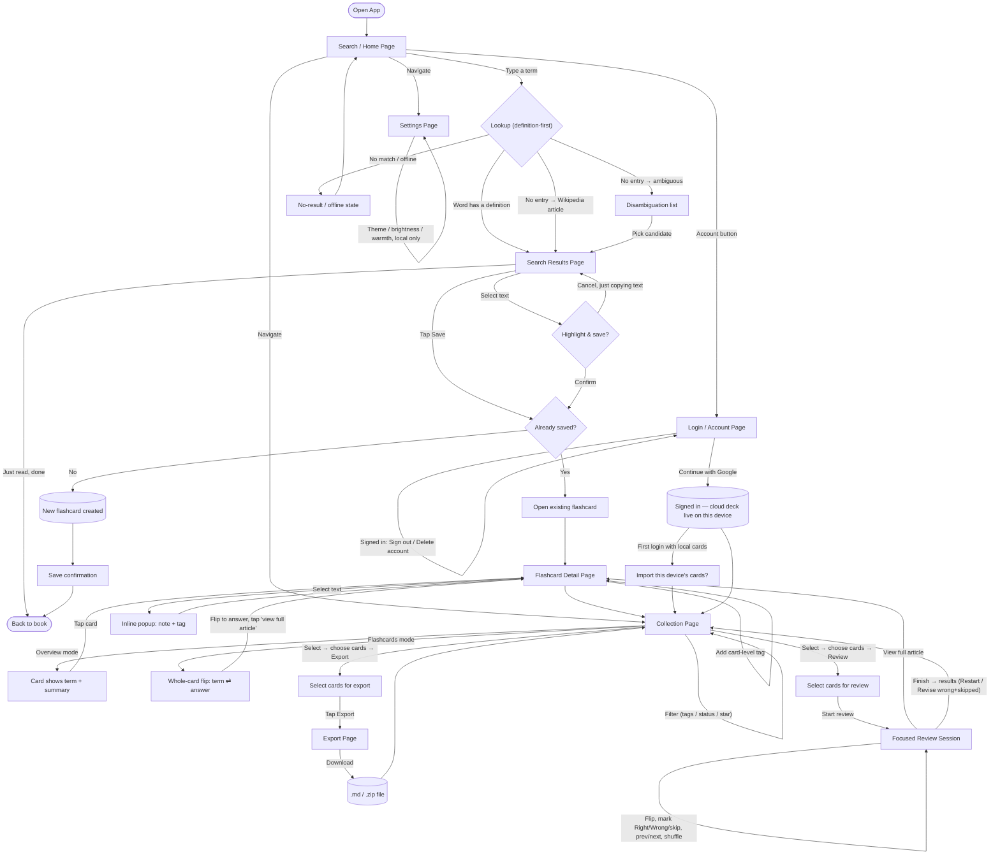
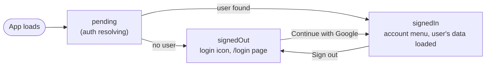

# PRD: Glossary — Distraction-Free Wiki Lookup for Book Readers

> **Build status (2026-07-11):** working prototype in `app/` — search, save, highlight/annotate, flashcards, export, settings, and **multi-user accounts (§8 Phases A–D)** are functional: Google sign-in with a `/login` account page, per-user Firestore cloud deck with diff-sync, first-login import of the device's local cards, self-serve account deletion, and Privacy/Terms pages. Device pairing is removed — signing in is what links a device. Signed-out use still persists to `localStorage` only. Remaining §8 work: the owner's Console account-removal runbook, production deploy, and the 2-device isolation test. The visual language is captured in `docs/design.md` (+ `docs/design.html`).
>
> **v2 amendment (2026-07-10) — multi-user accounts.** The product is being taken from a *single-user, no-accounts, device-pairing* design to a **multi-user model where each person signs in with a Google account and gets their own isolated flashcards, history, exports, and review data**. This supersedes the single-user assumptions in §2.1, §2.2 (Device Pairing page), §5 (anonymous auth + authorized-devices), §6 (phases 9–10), and §7. **Section 8 is the source of truth for the account model, data model, security rules, quota strategy, compliance, and the phased implementation flow.** Decisions locked with the requester: Google sign-in only; persistent session (no inactivity timeout); accounts *replace* device pairing; self-serve account deletion for users plus Firebase-Console-based admin removal (runbook, no in-app admin panel yet); target scale ~tens of users, staying on Firebase's free (Spark) tier.

## 1. Executive Summary

**Product overview.** Glossary is a minimalist, installable web app that lets a physical-book reader look up an unfamiliar term in seconds, see just Wikipedia's short intro paragraph and lead image, and get straight back to reading. Terms worth remembering can be saved as flashcards — highlighted, annotated, and tagged — and later exported as Markdown files into Obsidian or Notion. The app runs on any modern phone or laptop browser, works offline for anything already looked up, and syncs flashcards between the reader's own paired devices.

**Problem statement.** Looking up a word on a phone normally means opening a browser or the Wikipedia app — one tap away from social media, messages, or a Wikipedia rabbit-hole. Readers either get pulled off-task, or avoid the lookup entirely and forget the word. There is no existing tool whose *only* job is a fast, contained, distraction-free lookup with a path into a personal revision system.

**Target audience.** The requester themself, as a solo passion project: a reader who wants zero-friction lookups mid-book and a personal, growing glossary of terms to revise later — with no public accounts, no ads, no server bills, and no prior coding experience required to build it.

**Personal goals this serves** (in place of "business goals," since this is a non-commercial personal project): read more deeply without digital distraction; build a durable, personally-curated vocabulary; keep the tool costing $0 to run indefinitely; make it something a first-time builder can actually finish and maintain.

## 2. Key Features

### 2.1 Overarching Product Features

- Instant Wikipedia lookup: intro paragraph + lead image only — never the full article, never a "read more" link out. Long summaries are height-capped with a "show more" affordance so a scan never turns into a scroll.
- Live search suggestions as you type (not just after submit), plus disambiguation candidates for ambiguous or informally phrased searches — both aimed at recovering gracefully from a rushed, one-handed, possibly mistyped search. When a query looks misspelled, a Datamuse-backed **"Did you mean?"** correction leads the suggestions, and the no-results screen offers the same one-tap fix — so a typo like "viviseting" still reaches "vivisecting" instead of dead-ending. The correction is suppressed for real words and for hits that merely complete the typed prefix, so it surfaces only on a genuine misspelling; the payoff matters most for dyslexic readers and for one-handed typing.
- Definition-first dictionary: a direct search — pressing Enter, or the dictionary row that now leads the suggestions dropdown — opens the **dictionary definition** (part-of-speech-grouped meaning, IPA pronunciation with audio when available, and tappable synonyms), since checking what a word *means* is the most common lookup; it falls through to Wikipedia only for terms with no entry (phrases, proper nouns), so it never dead-ends. Reached another way — a Wikipedia suggestion, a recent search — a lookup still runs Wikipedia-first and keeps the dictionary as a **fallback** for a 404 or a low-value disambiguation stub (e.g. "ignominy"). A visible source indicator (a "Wikipedia" / "Dictionary" badge on the result and saved card, and a tag in the suggestions dropdown) tells the reader where a term came from. Source is the *only* difference: a dictionary term is highlighted, annotated, reviewed, and exported exactly like a Wikipedia one.
- Recent searches list for picking a lookup back up after an interruption.
- Cached lookups work offline: any term looked up once stays available with no connection; a brand-new term still needs one.
- A bookmark-toggle flashcard save, plus a highlight-to-save path: the bookmark icon shows saved (filled) vs. unsaved (outline) state at a glance; the first tap saves silently (a toast confirms, and the page scrolls to the inline notes editor so the next step is visible), and tapping the filled bookmark again unsaves the whole card (confirming first if a note or highlights would be lost). Card-level **note + tags** are added afterward in an inline "Add notes & tags" editor below the article, not a dialog. Selecting text in a result — by mouse drag or touch long-press alike — surfaces a separate confirm action ("Highlight & save") rather than saving automatically, so plain text selection (e.g. to copy) never has a side effect. Saving checks the canonical Wikipedia title against existing flashcards first — if the term is already saved, the bookmark simply reflects that, never creating a duplicate.
- Inline annotation popup on any highlight, with separate **note** and **tag** fields; a card also carries its own card-level **note** and **tags**, both entered through an inline "Add notes & tags" editor below the article (the bookmark itself just saves).
- Two tag levels — on a specific highlight, and on the whole flashcard — unified by a **multi-select** tag filter that searches both (pick several tags at once; a card matching any of them shows), plus autocomplete against previously-used tags to stop near-duplicate tags (e.g. "Sapiens" vs. "sapiens") from fragmenting your organization.
- The saved terms live on a **My Collection** page with two display modes sharing one internal detail view: **Overview** (term, metadata, a summary preview, and — when present — the card note shown inline with a count of the card's highlights) and **Flashcards** (a whole-card 3D flip — term on the front, answer plus a "view full article" strip on the back; a card with any annotation marks its front with a ✎ and adds a notes view, reached by a button beside the article strip, that lays out the card note and each highlighted quote with any note of its own). Beyond tags, the collection filters by review status (reviewed / not), export status (exported / not — stamped whenever a card is included in a download), whether the card carries any **annotation** (a card note or a highlight, with or without a note), and a per-card **star** you set for quick recall; the filters live in a pop-out panel opened from a funnel icon whose badge shows how many are active, and the grid paginates at 12 cards. Together, the inline note, the Notes filter, and the flashcard notes view mean anything the reader saved on a card — a note or a bare highlight — is reviewable without opening the detail page. A single **Select** mode covers every bulk action — review, export, or a confirm-guarded **delete** — over any chosen set of cards. Neither display mode ever links out to the live Wikipedia article.
- A separate **focused review session**, launched by selecting cards and choosing **Review**: one large flip card at a time, centered, with shuffle, prev/next, and keyboard support (arrows to move, space to flip). On touch the deck also swipes tinder-style — drag left for the next card, right for the previous — and every advance (swipe, arrows, keys, or a verdict) plays the same card-fling animation on phone and desktop alike. A star on the session card marks a hard term mid-session for later recall via the Starred filter. Revealing a card's answer marks it reviewed; the deck is ordered least-recently-reviewed first so revision surfaces neglected terms instead of the same easy ones. Once the answer is shown, **Right** / **Wrong** buttons record how you did and fling to the next card — advancing without marking counts as a skip; finishing the run opens a results screen (you pass when correct answers outnumber wrong-plus-skipped) that can **Restart** the whole deck or **Revise** just the wrong-and-skipped cards. The session holds its place through a detour into a card's full detail and back.
- Multi-select export to Markdown (single file or bundled `.zip`) with YAML frontmatter and embedded images, formatted for Obsidian/Notion — with the known limitation that this produces a downloaded file you move yourself (no direct vault/Notion-API integration), and that Notion's import doesn't parse YAML frontmatter into structured page properties the way Obsidian does.
- Dark and light themes; light mode adds independent brightness and warmth sliders. Adjustable font size/line length for reading comfort. Theme and display preferences are stored per device, not synced — a phone can stay dark for night reading while a laptop stays light for daytime work.
- Installable as a PWA on Android, iOS, and desktop (Chrome/Edge's address-bar install icon), with install nudges tailored to each — on Safari specifically, mobile and desktop alike, this protects not just cached data but the device's sync identity itself (see Section 7).
- Full keyboard and mouse support on desktop as a first-class interaction path, not a scaled-up version of touch: shortcuts beyond the initial search-focus (Enter to submit, Esc to close, Tab through cards), right-click context menus on flashcards, hover-revealed controls, and native shift/cmd-click multi-select alongside mobile's tap-based select mode.
- Cross-device sync via Firebase, scoped to your own paired devices only (no public accounts), with a visible list of currently-paired devices and the ability to revoke one — so a lost, sold, or handed-down device doesn't retain standing access to your data.
- A quiet, passive "updated on Wikipedia" badge on a flashcard whose source article has changed since it was saved — no popup, no auto-replace; your saved content never changes on its own. The detail view offers one reader-controlled "update saved copy" action that pulls in the live text and re-anchors existing highlights (warning if any no longer match) — the only path by which a saved copy is ever replaced, and always at the reader's initiative.
- Manual JSON export/import as a secondary backup, independent of Firebase.
- Zero third-party analytics or trackers; a small "via Wikipedia" text credit for license compliance (CC BY-SA), never a clickable link.

### 2.2 Breakdown by Page

| Page | Description | Key Components | Function |
|---|---|---|---|
| **Search (Home) Page** | The default landing view every time the app opens. | Centered hero search input (Google-homepage style) under the wordmark, with live suggestions; recent-searches list directly below; top bar carries only nav access to Collection and Settings. | Get the reader typing immediately, and recover gracefully from a rushed or slightly mistyped search before it ever becomes a dead end. |
| **Search Results Page** | Shown after a search resolves. | Height-capped intro paragraph (selectable text); lead image; source badge (Wikipedia/Dictionary) beside the title; source-appropriate credit line; for a dictionary result: IPA pronunciation with audio (when available) and a tappable synonyms row; bookmark save toggle (silent save; a second tap unsaves); an inline "Add notes & tags" editor and an "Existing notes" section (the saved card note + each highlight as a uniform saved-item card with EDIT/REMOVE — EDIT flips the item itself into an in-place editor; the popup note dialog appears only when a note is first created from the selection toolbar) shown once the card is saved; every tags field carries a ▾ recent-tags dropdown (top 5 by use recency, stored locally); "updated on Wikipedia" badge; disambiguation candidate list (with a "see the dictionary definition" option above it when the word is defined); no-result/offline message. | Present just enough to understand the term and either save it or leave; the confirm-to-highlight interaction and duplicate-save check both live here, and a saved term shows its annotations without opening the flashcard. |
| **Collection Page** | Grid of saved flashcards (formerly "My Flashcards"). | Overview/Flashcards display toggle (Flashcards = whole-card flip); saved-card text search under the title; a pop-out filter panel behind a funnel icon with an active-count badge (segmented Reviewed / Exported / Starred rows plus the multi-select tag filter, with Clear all and Done); per-card star toggle; 12-per-page pager; one **Select** mode whose action bar shows an N-selected count with Select all / Clear / Cancel and three actions — Review (primary), Export, and a confirm-guarded Delete — disabled until cards are picked (opening Select folds the filter panel; on narrow screens the bar sticks below the top bar); empty states for a new user and for a filter/search that matches no cards. | Browse, filter, and bulk-act on chosen cards: launch a focused review, export, or remove them from the collection. |
| **Review Session (focused mode)** | Full-screen single-card study flow, reached from the Collection page's Select → Review. | One centered whole-card flip (tap/space to reveal the answer, tap to flip back) with a corner star toggle; tinder-style swipe navigation on touch (left = next, right = previous), with the same card-fling animation on arrows, keyboard, and verdicts; Right/Wrong buttons that record a verdict once the answer is shown and fling onward (advancing without one is a skip); shuffle; prev/next arrows with an "n / total" position; a "view full article" strip on the answer face; back control to the collection; a results screen scoring the run (pass when correct outnumber wrong+skipped) with Restart and Revise (wrong+skipped) actions. | Deliberate revision of a chosen subset — the study counterpart to the Collection's browsing views. |
| **Flashcard Detail Page** | Full record for one flashcard. | Saved (frozen) summary + image; card-level note + tags edited inline in an "Add notes & tags" editor, shown as a saved item under "Existing notes" once set; highlighted spans with their notes/tags as uniform saved-item cards, each edited in place via EDIT (clicking a highlight in the text opens the same in-place editor; the popup note dialog is creation-only); "updated on Wikipedia" badge with a reader-controlled "update saved copy" action; edit/delete controls (hover-revealed on desktop, always-visible on touch). | Where annotation actually happens — adding, editing, or removing highlights, notes, and tags after the initial save. Text selection is precise mouse drag-select on desktop; touch adds a tap-to-select-sentence shortcut alongside manual drag, since dragging is inherently less precise on a touchscreen. |
| **Export Page (sheet/modal)** | Appears from the Collection page once cards are selected under the Export action. | Selected-card summary; export-format confirmation; **Download** trigger; when signed in, an **EMAIL TO ME** action that bundles everything as one zip named `(DD-MM-YYYY) Glossary Export.zip` — on a phone it hands the file to the share sheet (attach directly into the mail app); on a computer it downloads the zip and opens a Gmail compose tab pre-addressed to the account (the reader attaches the downloaded file — browsers cannot attach files to outgoing mail, and true server-side sending would need Cloud Functions, ruled out on Spark). | Bundle selected flashcards into Markdown (with embedded images) for Obsidian/Notion, understanding this hands off a file rather than syncing directly into either tool. |
| **Settings Page** | App-wide, per-device preferences plus account actions. | Display group (theme toggle; brightness/warmth sliders; font size — per device, never synced); Data group (JSON backup/restore); **Sync** group (signed-out: explanation + link to sign in; signed-in: cloud-sync status and an "Import this device's cards" action for local cards saved while signed out). | Central place for anything that isn't a daily action; sync access is audited by who is signed in, not by device lists. |
| **Login / Account Page** (`#/login`) | Reached from the top bar's account button (far right, after Settings; grayscale avatar when signed in). | Three states — signed out: "Continue with Google" plus a plain-language pitch and links to Privacy/Terms; signing in: progress state; signed in: avatar, name, email, Sign out, and a confirm-guarded **Delete account** (types-DELETE dialog; purges cards, review history, and export records, then the Auth user). | One place for identity: signing in is what links a device; deletion is self-serve (right to erasure, §8.7). |
| **Privacy & Terms Pages** (`#/privacy`, `#/terms`) | Quiet text pages linked from the login page. | Plain-language privacy policy (what is stored, where, and that the app stores no passwords) and a short terms of service. | §8.7 compliance surface for a multi-user app. |
| ~~**Device Pairing Page**~~ *(v1 — removed in v2, see §8.2)* | Was: shown when linking a new device. | — | **Replaced by Google sign-in** (built: see Login / Account Page above). Signing in on a device is what links it; there are no pairing codes. |

### 2.3 Mobile and Desktop Parity

This app is meant to be used equally on phones and on laptops/desktops, not mobile-first with desktop as an afterthought layered on top. A few implications worth stating explicitly:

- Cross-device sync (Section 5) already treats every paired device as an equal peer that can independently create flashcards — that was true from the original design and needs no change here.
- Input method, not just screen size, drives the real interaction differences: touch relies on long-press text selection, tinder-style deck swiping in review, a tap-to-select-sentence shortcut, and a select-mode toggle for multi-select; desktop's mouse and keyboard support precise free-form drag-select, hover-revealed controls, right-click context menus, and native shift/cmd-click multi-select. These are first-class, per-input-method behaviors, not one interaction pattern stretched across both.
- PWA installability has three cases, not two: Android's automatic install banner, iOS Safari's manual "Add to Home Screen," and desktop Chrome/Edge's address-bar install icon (plus macOS Safari's "Add to Dock," which carries the same storage-eviction stakes as iOS — see Section 7).
- The no-outbound-links rule (Section 2.1) applies identically on both platforms — a desk context doesn't get a relaxed version of it, and if anything the guardrail matters more on desktop, where a full browser with all your other open tabs is one click away.
- Layout is the one open question, left for the design system phase rather than decided here: whether wide desktop viewports get a master-detail, side-by-side layout (e.g. flashcard list + detail panel together, no full-page navigation) versus the same single-view-at-a-time flow as mobile, just scaled up. Worth prototyping both before locking one in.

## 3. User Journey

Different reasons to open the app lead through different pages. The flow below covers the core paths: a quick lookup, saving with duplicate-detection and with or without a highlight, browsing/reviewing, exporting, and signing in to sync across devices.



**Key touchpoints by use case:**

- **Quick definition check** (highest frequency, lowest intent): Home → Results → back to book. No save. Two pages, under 15 seconds.
- **Lookup + keep**: Home → Results → tap Save → duplicate check → confirmation toast → back to book. Two pages, one tap, one silent safeguard.
- **Annotate/enrich**: Either inline on Results (select text → confirm highlight, one extra tap), or later via Collection → Detail → select text → note/tag popup.
- **Revise/study**: Home → Collection → (optionally filter to a topic/tag) → Select → choose cards → Review → focused review session, least-recently-reviewed first → flip through cards, mark each Right or Wrong (or skip past with a swipe/arrow) → see a scored results screen → occasionally into Detail. Never touches Search/Results.
- **Curate/export**: Collection → Select → choose cards → Export sheet → Download, or (signed in) EMAIL TO ME — the `(DD-MM-YYYY) Glossary Export.zip` goes to the phone's share sheet or downloads beside a pre-addressed Gmail compose tab (or Delete to prune the collection). Often a laptop-based session.
- **Account / sync** (occasional): top-bar account button → Login page → Continue with Google → this device now reads and writes the account's cloud deck; on a first login with local cards, a one-time offer imports them. Sign out or delete the account from the same page.

## 4. What Success Looks Like

Since the app deliberately has no accounts, no server-side tracking, and no external analytics, every metric below is tracked **locally, on-device, visible only to the reader** — nothing is sent anywhere.

| Metric | Target | How it's tracked |
|---|---|---|
| Time back to primary task (simple lookup) | Under 15 seconds | Local timestamp diff between app open and app backgrounded/closed, averaged and shown in Settings. |
| Lookup response time | Under 2 seconds from search submit to summary rendered | Verified during build/testing; not an ongoing telemetry metric. |
| Rabbit-hole incidents | Zero, by construction | Build-time audit confirming no page contains a link to a live Wikipedia URL. |
| Flashcard review rate | At least half of saved cards opened once within 30 days | Local per-card "last viewed" timestamp compared to save date. |
| Export usage | At least one completed export per month | Local counter of completed export actions. |
| Sync reliability | Zero failed/conflicting syncs per month | Local success/failure counter logged on each sync attempt. |
| iOS storage safety | App running in installed/standalone mode on iOS, not a bare browser tab | `display-mode: standalone` check, logged locally; used to re-prompt install only if not detected. |
| Paired-device hygiene | Zero unrecognized devices with standing access | Paired-devices list in Settings, reviewed periodically by the reader. |

## 5. Tech Stack

The frontend stays a zero-build static site; the one real backend piece is Firebase, added specifically to support real cross-device sync where both devices can independently create flashcards.

| Layer | Choice | Why |
|---|---|---|
| Structure/style/logic | Plain HTML/CSS with Alpine.js (~15KB, no build step) for interactive state | Card modes, multi-select, and inline popups mean real interactive state; Alpine's declarative bindings (`x-data`, `x-show`, etc.) keep the screen in sync with that state automatically, reducing handwritten bookkeeping code — the kind of subtle bug that's hardest to catch in a project you're not reading line-by-line yourself. |
| Data source (primary) | Wikipedia REST API (`/api/rest_v1/page/summary/{title}`) for intro + image; Action API `opensearch` for live suggestions/disambiguation | Free, keyless, CORS-accessible directly from client JS — no proxy server needed. |
| Data source (dictionary) | Free Dictionary API (`dictionaryapi.dev`) for definitions, IPA phonetic, and audio; Datamuse (`api.datamuse.com`) for synonyms (`ml=`) and for the suggestions dropdown's "Did you mean?" spelling correction (`sug=`) | A direct search leads with the dictionary definition (checking a word's meaning is the commonest lookup); a Wikipedia-first lookup reached another way keeps the dictionary as a fallback when Wikipedia has no usable article (a 404, or a low-value disambiguation stub) — either way the reader never dead-ends. Both APIs are free, keyless, and CORS-accessible from the browser — preserving the no-backend architecture. Datamuse covers the synonym gap because dictionaryapi.dev's own synonym arrays are sparse for exactly the uncommon words that miss Wikipedia. Source is the *only* thing that distinguishes a dictionary card from a Wikipedia one — highlighting, notes, tags, review, and export are identical (drift-tracking is skipped, since a dictionary entry has no Wikipedia revision). |
| Flashcard storage & sync | Firebase Firestore (Web SDK, offline persistence enabled) | Firestore's client SDK caches data locally and syncs automatically in the background when a connection is available — this replaces what would otherwise be a custom local-database-plus-manual-merge system. **v2 (§8.3):** each user's flashcards, review history, and exports are namespaced under `users/{uid}/…` (one document per card), isolated by security rules. The free (Spark) tier's write quota is a *shared* bucket across all users, so the §8.5 batching is what keeps ~tens of users at $0. |
| User identity & auth | Firebase Authentication — **Google sign-in only** (§8.2) | Replaces v1's anonymous auth + device-pairing model. Google supplies a stable `uid`, verified email, and name; the app stores no passwords. Persistent session, no inactivity timeout. Identity is the sync boundary — signing in on a device is what "pairs" it. |
| Local-only preferences | `localStorage`, not Firestore | Theme, brightness/warmth, and font size are per-device by design and never sync — see Section 2.1. |
| Ephemeral lookup cache | Local-only (IndexedDB or Cache API), separate from Firestore | Previously-viewed (but not saved) Wikipedia summaries don't need to sync across devices — keeping this local-only avoids syncing throwaway data. |
| Markdown export | `turndown` (HTML→Markdown) + `jszip` + `file-saver`, pinned to fixed versions | Converts Wikipedia's HTML summary to clean Markdown; bundles multi-card exports into one `.zip`; triggers the browser download. Pinning avoids an unreviewed upstream update silently changing behavior in a project with no test suite. |
| Theming | CSS custom properties, toggled/adjusted by Alpine-bound controls | Consistent with the rest of the interactive layer. |
| Installability/offline shell | Web App Manifest + a small Service Worker + a Content-Security-Policy meta tag | Installable to the home screen; caches the app's own files for instant, chrome-free opening; the CSP tag is a cheap extra layer of defense given the app renders externally-sourced HTML. |
| Hosting | GitHub Pages (or Netlify/Vercel free static tier), optionally auto-deployed via GitHub Actions on push | $0 forever for the static frontend; Firebase is a separate free-tier service, not part of the hosting bill. Auto-deploy is a nice-to-have, not required. |
| Version control | Git, run directly by Claude Code (`git add/commit/push`) | Needs a free GitHub account, an empty repo, and one-time authentication (e.g. `gh auth login`) — no separate GUI tool required. |

Total recurring cost: **$0** at personal-use volume on both GitHub Pages and Firebase's free tier. Accounts needed: one free GitHub account, one free Firebase (Google) account.

## 6. Build Workflow

Build in small, independently-testable slices; test each one in the actual browser before moving to the next.

1. **Search → result.** Search box with full keyboard support from the start (Enter to submit, Esc to clear — not retrofitted later), fetch Wikipedia summary, display height-capped paragraph + image.
2. **Live suggestions + disambiguation + no-result handling.** As-you-type suggestions, opensearch candidates, and a graceful "no article found"/offline state.
3. **Save as flashcard (local only, no Firebase yet).** Core save/browse loop against local storage first, including the duplicate-title check, so Firebase is layered onto a working app rather than being a dependency from day one.
4. **Collection: display modes, filters, and focused review.** Overview and Flashcards (whole-card flip) display modes over a shared detail view; multi-select tag / status / star filters in a pop-out panel; a Select mode whose action bar launches a focused review session (least-recently-reviewed-first ordering, shuffle, swipe/fling navigation, Right/Wrong verdicts with a scored results screen), an export, or a confirm-guarded bulk delete.
5. **Highlight, annotate, tag.** Inline confirm-to-highlight on Results (with a tap-to-select-sentence shortcut); inline note/tag popup on Detail; card-level tags; tag autocomplete.
6. **Markdown export.** Turndown + JSZip + file-saver: single-card export first, then multi-select bulk export.
7. **Theming.** Dark/light toggle, then brightness/warmth sliders and font-size control — stored in `localStorage`, per device.
8. **PWA polish.** Manifest, service worker, offline cache of past lookups, install prompts tailored per platform (iOS "Add to Home Screen," macOS "Add to Dock," Android's automatic banner, desktop Chrome/Edge's address-bar icon), CSP meta tag. Run a Lighthouse PWA audit to confirm installability rather than assuming it.
9. **Multi-user accounts & cloud sync (v2 — see Section 8).** *Supersedes the original single-user Firebase/pairing phases.* Google-only Firebase Auth; per-user Firestore schema (`users/{uid}/…`, one doc per card); `uid`-scoped security rules written and tested first (highest-severity — §7/§8.4); swap local flashcard storage for Firestore with the §8.5 write-optimisations; three-state auth UI with a `/login` page and route guards; first-login `localStorage`→account migration.
10. **Account lifecycle & compliance (v2 — see Section 8).** *Replaces device pairing/management.* Self-serve account deletion (recursive data purge + Auth delete); Privacy Policy + short ToS; owner's Firebase-Console account-removal runbook. Device pairing and one-time codes are removed — signing in is what links a device.
11. **Passive Wikipedia-drift indicator.** On-view-only check, badge only, no auto-replace.
12. **Deploy + cross-platform test.** Push to GitHub Pages (optionally via GitHub Actions); test on an Android phone (Chrome), an iPhone (Safari), and desktop (Chrome/Edge, plus Safari on a Mac if applicable — the same storage-eviction risk applies there); confirm sync and revoke both work between an actual phone and an actual laptop.

**Working practices for a non-coder using AI to build this:** ask for one phase (or one feature within a phase) at a time and confirm it works before moving on; keep code split into a few small files by concern (`search.js`, `storage.js`, `sync.js`, `export.js`, `theme.js`, `cards.js`); when something breaks, open DevTools (F12), copy the exact error text, and paste it back verbatim; commit after every working phase so there's always a last-known-good state; test on real devices early, not just a desktop browser.

## 7. Rules: Good Practices and Security

**Version control**

- Commit after every working phase (Section 6), not just at the end of a session — the goal is always having a last-known-good state to roll back to.
- Let Claude Code run `git add/commit/push` directly rather than hand-typing git commands; still requires a one-time GitHub authentication setup.
- Since this is a solo project, committing straight to the main branch is fine — a separate branch-per-feature workflow would add process overhead without a corresponding benefit here.
- Tag or note a commit right before adding Firebase (Phase 9) specifically, since it's the biggest architectural jump — a clear rollback point if anything about the sync integration goes sideways.
- Pin dependency versions (Turndown, JSZip, file-saver, Firebase SDK) rather than always-latest, since there's no automated test suite to catch a bad upstream update.

**Security**

- **(v2 — §8.4)** Firestore access must be restricted by security rules so a user can read and write **only their own** `users/{uid}/…` subtree (`request.auth.uid == uid`) — never left open. With multiple users this is the single highest-severity thing in the whole build to get right: a wrong rule exposes one user's data to another, which is a reportable breach, not just a bug. Rules are written and tested before any data-access code.
- **(v2)** Because every user draws on the *same* free-tier write quota, the §8.5 write-batching (per-card docs, one write per review session, debounced edits) is a reliability control, not just an optimisation — an unbatched loop that's invisible at one user can exhaust the shared daily quota once a few accounts are active.
- A Firebase web API key is not a secret by design (Firebase's own security model relies on rules, not on hiding the key) — don't spend effort trying to hide it; spend the effort on getting the security rules right instead.
- Sanitize or escape any HTML pulled from Wikipedia's summary response before inserting it into the page, and set a Content-Security-Policy meta tag as a second layer of defense — treat externally-sourced content as untrusted by default, even from a generally reliable source like Wikipedia. The CSP's `connect-src` is an explicit allow-list, so any new data source (the dictionary/synonym APIs, `api.dictionaryapi.dev` + `api.datamuse.com`, plus `media-src` for pronunciation audio) must be added there or the browser silently blocks the fetch — a failure mode invisible to server-side API tests.
- Add a simple client-side debounce/guard against rapid duplicate writes (e.g. a bug causing a retry loop), rather than relying solely on Firestore's own daily quota as the safety net.
- Identify API requests to Wikipedia with a descriptive User-Agent, per Wikimedia's API etiquette guidelines.

**Risk register**

| Risk | Mitigation |
|---|---|
| Safari evicts local storage after 7 days of non-use if the app isn't installed — on iOS *and* on macOS alike, not an iOS-only issue — which can silently break sync identity, not just cached data | Explicit install nudge on both ("Add to Home Screen" on iOS, "Add to Dock" on macOS); Firebase sync also means a storage wipe on one device doesn't mean permanent flashcard loss, though re-pairing may be needed. |
| A lost, sold, or handed-down device retains standing sync access indefinitely | Visible paired-devices list in Settings with a working, rules-enforced revoke action. |
| The same term gets saved multiple times over months/years, cluttering the glossary | Save checks the canonical Wikipedia title against existing flashcards and opens the existing card instead of duplicating. |
| Wikipedia summary HTML contains unexpected markup (XSS risk) | Sanitize/escape before rendering; CSP meta tag as a second layer; never insert raw HTML directly. |
| Tag-name drift (e.g. "Sapiens" vs. "sapiens") weakens book/subject grouping | Tag autocomplete against previously-used tags. |
| **(v2)** Misconfigured Firestore rules let one user read another's data (reportable breach) | Rules scoped to `users/{uid}` with `request.auth.uid == uid` (§8.4); written and tested *before* data code, not assumed correct by default. |
| **(v2)** Shared free-tier write quota exhausted by unbatched writes across users | Per-card documents, one write per review session, debounced edits, single listener (§8.5); existing duplicate-write debounce retained. |
| **(v2)** Holding other users' personal data creates erasure/privacy obligations | Self-serve account deletion (recursive purge + Auth delete) and owner Console runbook; Privacy Policy + ToS; Google-only auth so no passwords are ever stored (§8.6–8.7). |
| Highlighting text accidentally creates unwanted flashcards | Explicit "Highlight & save" confirm action, not an automatic save on any text selection. |
| Data loss before a second device is paired | Manual JSON export/import as a secondary backup, independent of Firebase. |
| A runaway client bug burns through Firestore's daily free-tier quota | Client-side debounce/guard against duplicate rapid writes. |
| Export expectations mismatch — a loose file, not a live vault sync; Notion doesn't parse frontmatter into properties like Obsidian does | Documented as a known, accepted limitation of a no-backend architecture rather than left as a silent surprise. |
| Solo, first-time-coder build stalls on an unfamiliar error | Small phased build order; DevTools-error-paste workflow; commit after every working phase. |
| Wikipedia API changes or informal rate-limiting | Use documented, stable REST endpoints; descriptive User-Agent; personal-use volume is far below any realistic limit. |

## 8. Multi-User Accounts & Cloud Sync (v2)

This section supersedes the single-user assumptions elsewhere in the PRD. Where v1 treated the app as one person's data spread across paired peer devices, v2 makes **identity the sync boundary**: a user signs in with Google on any device and sees exactly their own flashcards, recent searches, exports, and review history — and nobody else's.

### 8.1 Why the pivot, and what it costs

The v1 design deliberately avoided accounts to keep compliance and cost at zero. Real multi-user support reverses three of those choices on purpose: you become a **data controller** for other people's data, you take on a small **compliance surface** (§8.7), and Firestore's free-tier write quota becomes a **shared bucket** across all users (§8.5). The locked scope keeps the bill at **$0**: Google-only auth (no passwords to store), a persistent session (no server-side session store), account deletion handled in-app for users and via the Firebase Console for the owner (no Cloud Functions, so no Blaze billing plan required).

### 8.2 Account model and the three auth states

- **Auth provider:** Firebase Authentication with **Google sign-in only**. No email/password, no anonymous auth. Firebase supplies a stable `uid`, a verified email, and a display name — the app stores no credentials itself.
- **Session:** persistent (Firebase's default `browserLocalPersistence`). A user stays signed in until they explicitly sign out; there is no inactivity timeout. "Sign out" is a manual control in the account menu.
- **Pairing removed:** the v1 Device Pairing page and its one-time codes are dropped entirely. Signing in *is* pairing. A read-only "signed-in sessions" list may appear later but is not required for launch.
- **The UI has exactly three auth states**, driven by one reactive `authState` value:



`pending` must render a neutral skeleton, **not** the logged-out screen, or the app will flash the wrong UI on every load before Firebase resolves the session. Route guards on Collection / Review / Settings redirect to `/login` when `signedOut`.

### 8.3 Data model

Every piece of user data is namespaced under the owner's `uid`, and **one flashcard is one Firestore document** (not one giant array — see §8.5):

```
users/{uid}/cards/{cardId}          ← one doc per flashcard (title, extract, note, tags, highlights, timestamps, source, drift)
users/{uid}/reviewHistory/{sessionId}  ← one doc per completed review session (verdicts, score, date)
users/{uid}/exports/{exportId}      ← one doc per export event (card ids, format, timestamp)
users/{uid}/meta/recent             ← recent-search list (see note below)
```

Kept **local-only** (never written to Firestore), consistent with v1's intent:

- **Preferences** (`theme`, `brightness`, `warmth`, `fontScale`) — per-device by design (§2.1), stay in `localStorage`.
- **Ephemeral lookup cache** — the 60-entry summary cache stays local; throwaway data must not consume sync quota.
- **Recent searches** — default to local; sync only if the requester wants recents to follow them across devices (a per-search write, so kept off the network by default).

### 8.4 Security rules (highest-severity item)

Data isolation is enforced by Firestore rules, not by the client. This is the single most important thing to get right — a wrong rule lets one user read another's data, which is a reportable breach (§8.7), not merely a bug:

```
rules_version = '2';
service cloud.firestore {
  match /databases/{database}/documents {
    match /users/{uid}/{document=**} {
      allow read, write: if request.auth != null && request.auth.uid == uid;
    }
  }
}
```

Rules are written and tested **before** any data-access code is wired. The Firebase web API key is not a secret (§7) — effort goes into the rules, not into hiding the key.

### 8.5 Quota and write-optimisation

The v1 app is optimised for `localStorage`, where writes are free and synchronous, so it persists eagerly on nearly every state change. Ported naively, each of those becomes a billable Firestore write against a **shared** free-tier bucket (~20K writes / 50K reads / 20K deletes per day across *all* users). At the ~tens-of-users target these fixes are what keep the app free:

- **Card = one doc:** replace the whole-array `persistCards()` write with a single-doc `update()` for the card that changed.
- **Batch review sessions:** the v1 code persists on *every card flip* (`markReviewed`). Collect a session's results and commit **one** write at `finishSession()`.
- **Fix redundant drift writes:** v1 `checkDrift()` persists on *every lookup* even when nothing changed — write only when a drift flag actually flips.
- **Debounce edits:** note/tag edits debounce (~500 ms–1 s) so typing isn't one write per change.
- **One listener, attached once:** subscribe to the user's collections with a single `onSnapshot` when `signedIn`; detach on `signOut`. Never re-attach per route.
- **Keep the guard from §7:** the existing client-side debounce against runaway duplicate writes remains, now doubly important with multiple users on one quota.

### 8.6 Account lifecycle

- **First-login migration:** on a user's first sign-in, detect any flashcards sitting in this browser's `localStorage` and offer to import them into the account (dedupe by canonical title; the merge rule when both local and cloud hold the same title is a deliberate build-time choice).
- **User self-deletion:** the account menu offers "Delete my account and all my data," which recursively deletes `users/{uid}/**` and then the Auth record. This closes the GDPR/PDPA right-to-erasure gap for every user without any admin involvement.
- **Owner/admin removal (Console runbook, no code):** the project owner removes an abusive or stale account via the Firebase Console — delete the Auth user, then delete their `users/{uid}` subtree (or install the official "Delete User Data" extension to cascade automatically). An in-app admin panel (Cloud Functions + an `admin` custom claim + a users list) is deferred until the user count outgrows manual management; it is purely additive and reuses the same recursive-delete logic.

### 8.7 Compliance

Accounts turn the app from "nothing leaves the device" into a service holding other people's personal data on Google's infrastructure. New obligations (PDPA in Singapore; GDPR for any EU user):

- **Privacy Policy** (required): what's stored (Google profile email/name, flashcards and their content, review/export history), that it lives in Firebase (a Google sub-processor), and why.
- **Terms of Service** (short): acceptable use and a liability disclaimer, since others now rely on the service.
- **Consent / lawful basis:** a signup acknowledgement referencing the policy.
- **Right to erasure & portability:** self-deletion (§8.6) covers erasure; the existing JSON export (`exportJson`) already covers portability.
- **Breach posture:** the §8.4 rules are now a legal control, not just code — misconfiguration is a reportable incident.
- **Data minimisation:** Google-only sign-in means the app never stores passwords, deliberately shrinking the liability surface.

### 8.8 Implementation flow (Phases A–E)

Estimates assume Claude Code writes the code and the requester handles Firebase-Console setup and the real-device testing loop; ranges are dominated by testing and the two genuine risk areas (rules, migration), not raw coding. Total ≈ **4–5 focused days**, all on the free tier.

| Phase | Scope | Est. |
|---|---|---|
| **A — Firebase foundation** | Create project; enable **Google** auth provider; register the web app; add pinned Firebase SDK to `index.html`; init Auth + Firestore with offline persistence; **write and test the §8.4 security rules first**. | ~0.5 day |
| **B — Data layer** | Replace `lsGet/lsSet` for cloud collections with a Firestore adapter that bakes in the §8.5 optimisations (per-card docs, batched sessions, debounced edits, single listener); keep cache/prefs/recent local. | 1–2 days |
| **C — Auth UI** | Three-state `authState`; `/login` page with a single "Continue with Google" button; top-bar login/account icon; account menu + Sign out; route guards; listener attach/detach lifecycle. | ~0.5–1 day |
| **D — Migration & compliance** | First-login `localStorage`→account import; self-serve account deletion (recursive purge + Auth delete); Privacy Policy + short ToS pages. | ~1 day |
| **E — Docs, deploy & admin runbook** | Sync this PRD, `docs/design.md`, and `docs/design.html` to the shipped account UI; write the owner's Console-based account-removal runbook; deploy; test sign-in and data isolation across two real devices. | ~0.5 day |

Each phase is committed as its own working slice (§7). A tag is placed before Phase B (the largest architectural jump), as v1 recommended for the Firebase step.
